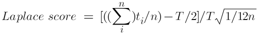

**SENG 438- Software Testing, Reliability, and Quality**

**Lab. Report \#5 – Software Reliability Assessment**

| Group: 5      |
|-----------------|
| Mohammed Zaid Shaikh   |
| Alexander Lai          |
| Odin Fox               |
| Aidan Gaede-Janke      |

# Introduction

This lab report is showcase of our group's use and practice of the C-SFRAT tool. Using this tool we could better assess the relibility and functionality of systems that are undergoing tests.  With this tool and knowledge we applied it to the hypothetical system given to us in this lab and tested it's reliability using this tool. 

The goal of this lab to assess the differences between the two ways of using the C-SFRAT tool, reliability growth testing and reiliability demonstration chart.

# Assessment Using Reliability Growth Testing

## Best Models
1. S with covariates E, F, and C
2. TL with covariates F and C

For this part of the assignment, we utilized C-SFRAT to evaluate our dataset against many models to identify the best fit. The dataset we created was based on the information found in "Failure Report 2," and some assumptions were made to fill in the required columns. The columns required for C-SFRAT to recognize the dataset were T: time interval, FC: failure count, E: execution time measured in hours, F: failure identification work measured in person-hours, and C: computer time failure identification measured in hours. Please find the assessment of the different models below.

The imported data originally looked like this:

We then evaluated all the models by selecting "Select All," which selected all the hazard functions and the covariates. This allowed us to get the maximum amount of models for this dataset, and the results are shown below:

In order to find the best two models for this specific dataset, we sorted the "Log-Likelihood" in decending order (largest to smallest):

As you can see, the two best-fitting models were the S Distribution with covariates E, F, and C and the Truncated Logistic with covariates F and C.

We also generated an Intensity Graph with the two best models that shows how well a model is able to predict and fit overtime with failure activity.

Below you can find the time before failure graph which displays the the time durations before a component fails:

## Range Analysis
To analyze the range of the data, we used the Laplace score test, in which we fed our data points into a formula and evaluated the results. The general statistic for the test is 1.96; hence, we should see some values above that with a 95% confidence rating.

The formula we used to calculate the Laplace Score is:

|              |              |                       |                   |
| ------------ | ------------ | --------------------- | ----------------- |
| **Time (T)** | **FC**       | **Cumulative FC (n)** | **Laplace Score** |
| 0.145555556  | 1            | 1                     | 1.733158          |
| 0.226388889  | 5            | 6                     | 1.21467           |
| 0.310555556  | 4            | 10                    | \-0.3413          |
| 0.478888889  | 4            | 14                    | \-2.53991         |
| 0.793055556  | 3            | 17                    | \-4.51915         |
| 0.868611111  | 2            | 19                    | \-5.01873         |
| 1.079166667  | 2            | 21                    | \-5.79545         |
| 1.260555556  | 2            | 23                    | \-6.38769         |
| 1.296111111  | 1            | 24                    | \-6.57885         |
| 1.347777778  | 1            | 25                    | \-6.7891          |
| 11.383333333 | 1            | 26                    | \-6.9726          |
| 1.770555556  | 5            | 31                    | \-8.05755         |
| 1.913055556  | 4            | 35                    | \-8.68717         |
| 2.269722222  | 3            | 38                    | \-9.30721         |
| 2.480277778  | 1            | 39                    | \-9.54669         |
| 3.060277778  | 2            | 41                    | \-10.0352         |
| 3.101388889  | 4            | 45                    | \-10.528          |
| 3.185555556  | 5            | 50                    | \-11.1279         |
| 3.366666667  | 4            | 54                    | \-11.627          |
| 3.596666667  | 3            | 57                    | \-12.0179         |

As you can see the data is not fitted very well as only a few values are decently close to the general statistic that we needed.

# Assessment Using Reliability Demonstration Chart

To calculate our MTTFmin we first calculated our MTTF using the formula:

MTTF = Total Execution Time (E) / Total Number of Failures (Summation of FC)

We then identified the lowest MTTF we observed, and it was 2.6. We were then able to plot the Reliability Demonstration Chart.

## 3 Variants of the Reliability Demonstration Chart

MTTFmin

Doubled MTTFmin

Halfed MTTFmin

The best outcome is when our MTTFmin is halved, which allows the entire plot to be in the acceptable range.

# Comparison of Results

In part one, the models generated range greatly in success for predicting the failure model. The log-likelihood value of the TL(F,C) models is -113.686 and IFRSB model is -21376.273. The TL(C) model also had a log-likelihood of -113.686. We looked at the TL(C) and TL(F, C) models as they had the highest log-likelyhood. For part 2, we found that the MTTF had an inverse relationship with the acceptablity of the failure tests. With a base MTTF value, the acceptability stayed in the yellow area indicating we should continue to test. When we doubled the MTTF, the acceptance fell into the red indicating rejection of the product. When the MTTF was halved, the acceptability fell safely into the green area indicating acceptable levels of failure.

# Discussion on Similarity and Differences of the Two Techniques
The differences between the techniques, RDC(reliability demonstration chart) and RGT(reliability growth testing) are mainly in their purpose. RDC is meant to test if the product is above a certain threshold of failure. It places the current state of the code into pass or fail categories. The pros of RDC are that it very clearly shows the acceptability of a sytem based on the requirements given and that it is cost efficient, needing little resources to perform. Cons to RDC are that it is not exact and quantifiable so you cannot use it for calculations. RGT is testing the code repeatedly while making incremental changes until it reaches a point of satisfaction. RGT is meant to be applied to a product over time to reduce the number of failures that occur. By taking previous data from reliability growth testing, it is possible to model a hypothetical best state of the code with minimal failures. The pro of RGT is that it can show if the relaibility of a system is increasing over time. The con is that it has to be used on a system that is being actively improved, it can't be used on a static SUT (system under test). 

# How the team work/effort was divided and managed

#

# Difficulties encountered, challenges overcome, and lessons learned

# Comments/feedback on the lab itself
