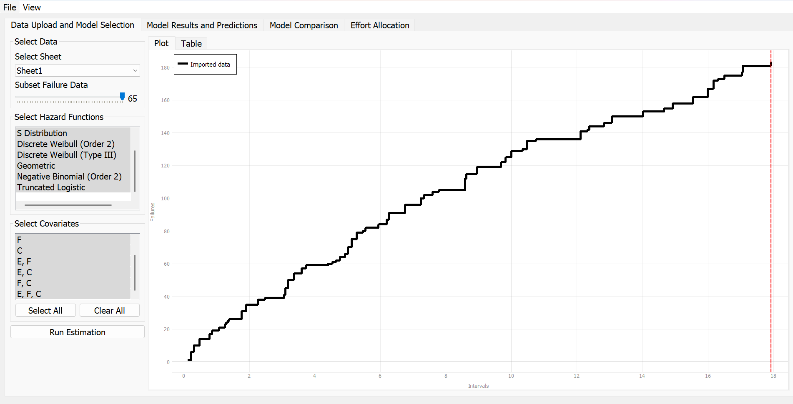
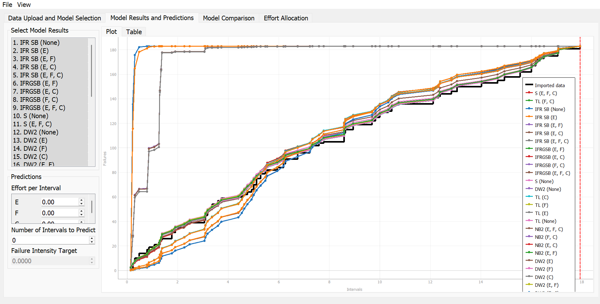
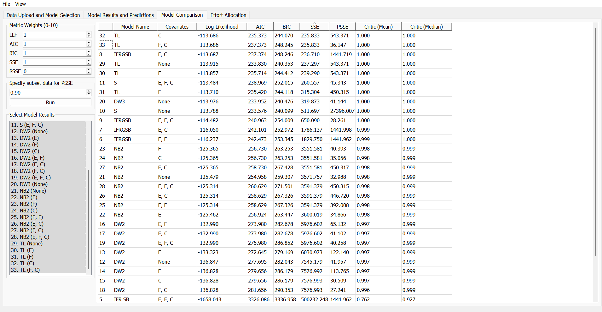
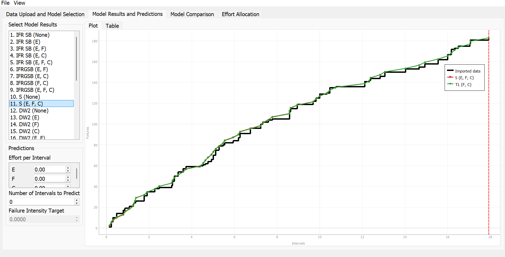
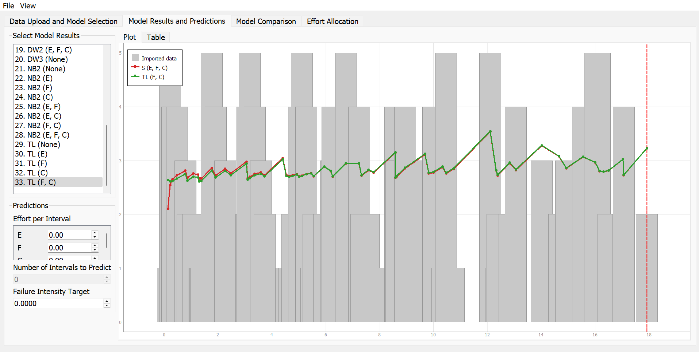
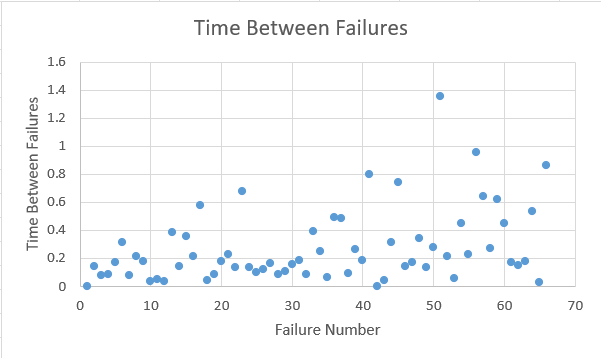
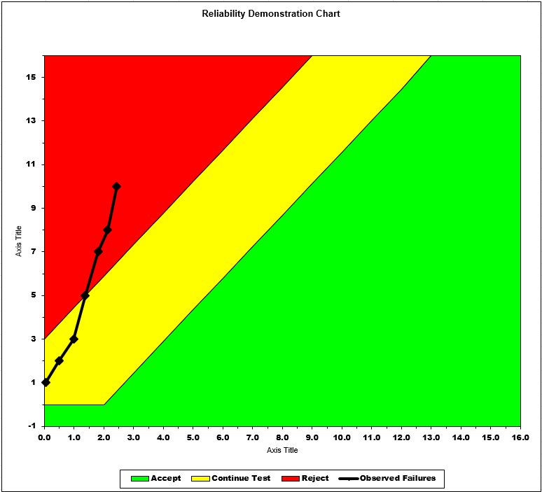

**SENG 438- Software Testing, Reliability, and Quality**

**Lab. Report \#5 – Software Reliability Assessment**

| Group: 5      |
|-----------------|
| Mohammed Zaid Shaikh   |
| Alexander Lai          |
| Odin Fox               |
| Aidan Gaede-Janke      |

# Introduction

#

# Assessment Using Reliability Growth Testing

## Best Models
1. S with covariates E, F, and C
2. TL with covariates F and C

For this part of the assignment, we utilized C-SFRAT to evaluate our dataset against many models to identify the best fit. The dataset we created was based on the information found in "Failure Report 2," and some assumptions were made to fill in the required columns. The columns required for C-SFRAT to recognize the dataset were T: time interval, FC: failure count, E: execution time measured in hours, F: failure identification work measured in person-hours, and C: computer time failure identification measured in hours. Please find the assessment of the different models below.

The imported data originally looked like this:

We then evaluated all the models by selecting "Select All," which selected all the hazard functions and the covariates. This allowed us to get the maximum amount of models for this dataset, and the results are shown below:

In order to find the best two models for this specific dataset, we sorted the "Log-Likelihood" in decending order (largest to smallest):

As you can see, the two best-fitting models were the S Distribution with covariates E, F, and C and the Truncated Logistic with covariates F and C.

We also generated an Intensity Graph with the two best models that shows how well a model is able to predict and fit overtime with failure activity.

Below you can find the time before failure graph which displays the the time durations before a component fails:

## Range Analysis

# Assessment Using Reliability Demonstration Chart

To calculate our MTTFmin we first calculated our MTTF using the formula:

MTTF = Total Execution Time (E) / Total Number of Failures (Summation of FC)

We then identified the lowest MTTF we observed, and it was 2.6. We were then able to plot the Reliability Demonstration Chart.

## 3 Variants of the Reliability Demonstration Chart

MTTFmin

Doubled MTTFmin

Halfed MTTFmin

The best outcome is when our MTTFmin is halved, which allows the entire plot to be in the acceptable range.

# Comparison of Results

# Discussion on Similarity and Differences of the Two Techniques

# How the team work/effort was divided and managed

#

# Difficulties encountered, challenges overcome, and lessons learned

# Comments/feedback on the lab itself
